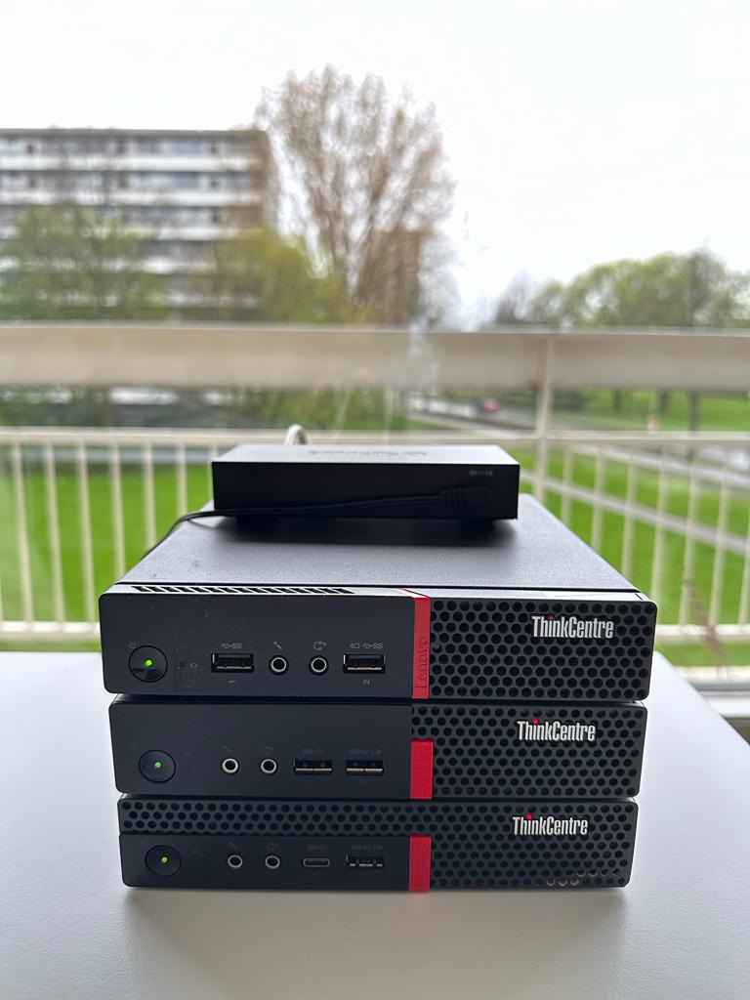

## Homelab

Metin Seylan's personal bare-metal Kubernetes cluster.

- Network
    - [PFsense](https://www.pfsense.org/)

- Apps
  - [ArgoCD](https://argoproj.github.io/argo-cd/)
  - [Grafana](https://grafana.com/)
  - [Kubernetes](https://kubernetes.io/)
  - [Metallb](https://metallb.universe.tf/)
  - [Nginx Ingress](https://kubernetes.github.io/ingress-nginx/)
  - [Prometheus](https://prometheus.io/)

- Hardware
  - Lenovo ThinkCentre Tiny 3x
    - Intel Core i7-7700T
    - Crucial 64GB DDR4 2666MHz
    - 1TB SSD
    - 1TB NVME

  

